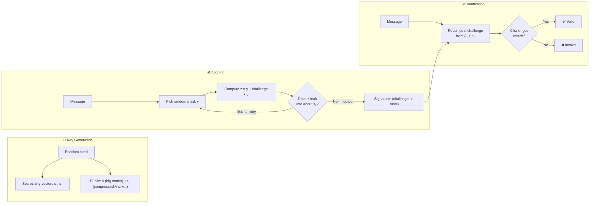
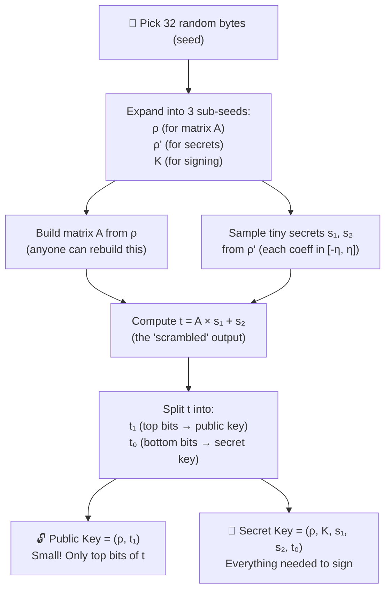
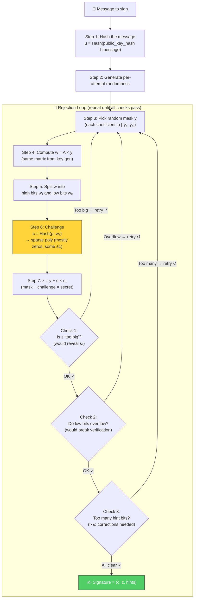
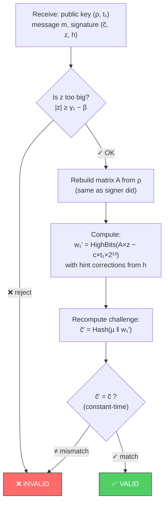
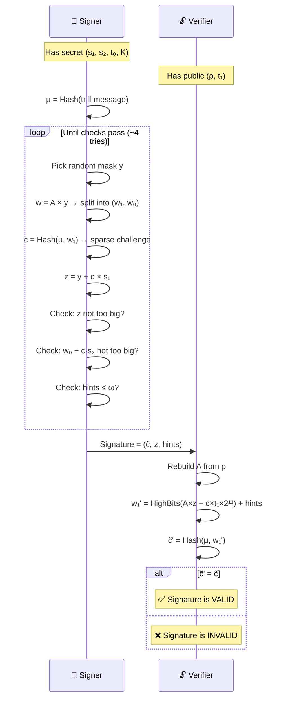

# Dilithium (ML-DSA) — How the Math Works

> **A plain-English guide to the mathematics behind Dilithium signing.**
>
> No prior lattice or cryptography background needed.
> Every concept is introduced with an everyday analogy first.

---

## Table of Contents

1. [The One-Sentence Version](#1-the-one-sentence-version)
2. [Building Blocks — The Math Toolkit](#2-building-blocks--the-math-toolkit)
3. [Key Generation — Making Your Keys](#3-key-generation--making-your-keys)
4. [Signing — Creating a Signature](#4-signing--creating-a-signature)
5. [Verification — Checking a Signature](#5-verification--checking-a-signature)
6. [Why Nobody Can Cheat](#6-why-nobody-can-cheat)
7. [Parameter Cheat Sheet](#7-parameter-cheat-sheet)

---

## 1. The One-Sentence Version

> **Dilithium signing is like solving a jigsaw puzzle where only you have the
> picture on the box (private key), everyone can check if pieces fit (public
> key), and a quantum computer can't guess the picture.**

Here's the whole scheme in one diagram:



---

## 2. Building Blocks — The Math Toolkit

### 2.1 Polynomials — Lists of 256 Numbers

Forget complicated algebra for a moment. A **polynomial** in Dilithium is
just a **list of 256 small numbers**. We write it as:

```
  a = [a₀, a₁, a₂, ..., a₂₅₅]
```

Each number is between 0 and **q − 1**, where **q = 8,380,417** (a carefully
chosen prime number).

**Adding** two polynomials: just add each pair of numbers (mod q).

**Multiplying** two polynomials: more involved — like convolving two signals,
with the special rule that the 257th position "wraps around" with a sign flip.
But you don't need to worry about the details; the computer handles this
using a trick called NTT (below).

### 2.2 Vectors of Polynomials

A **vector** is a small collection of polynomials bundled together:

```
  s₁ = [ poly₀, poly₁, poly₂, poly₃ ]     ← 4 polynomials (ML-DSA-44)
```

Each polynomial is 256 numbers, so s₁ is really **4 × 256 = 1,024 numbers**.

### 2.3 The Public Matrix A — A Big Mixing Machine

The matrix **A** is a grid of polynomials (like a spreadsheet where each cell
contains a list of 256 numbers):

```
  A is k × ℓ  (e.g., 4×4 for ML-DSA-44)

       ┌─────────────────────────────┐
  A =  │ poly  poly  poly  poly     │  ← row 0  (4 polys)
       │ poly  poly  poly  poly     │  ← row 1
       │ poly  poly  poly  poly     │  ← row 2
       │ poly  poly  poly  poly     │  ← row 3
       └─────────────────────────────┘
```

Multiplying A by a vector s is like scrambling s through a giant blender —
easy to compute forward, but **impossible to reverse** without the secret.

> **Analogy:** A is like a one-way food blender. You can blend ingredients (s₁)
> into a smoothie (t = A·s₁ + s₂), but you can't un-blend a smoothie back
> into its ingredients. That's the hard problem protecting the scheme.

### 2.4 NTT — Making Multiplication Fast

Multiplying two 256-number polynomials naively takes 256² = 65,536 operations.
The **Number Theoretic Transform (NTT)** does it in about 256 × 8 = 2,048 — that's **32× faster**.

It works like the Fast Fourier Transform (FFT) but with integers mod q instead
of complex numbers:

```
  Step 1:  Transform both polynomials    a → â,  b → b̂     (NTT)
  Step 2:  Multiply element-by-element   ĉᵢ = âᵢ × b̂ᵢ     (pointwise)
  Step 3:  Transform back                ĉ → c              (inverse NTT)
```

The NTT uses "butterfly" operations — pairs of additions and subtractions
scaled by precomputed constants (called **twiddle factors** or **zetas**):

```
    aⱼ ───────┬──── (+) ──── new aⱼ
              │
    ζ ──── (×)                          ζ = precomputed constant
              │
    aⱼ₊ₖ ────┴──── (−) ──── new aⱼ₊ₖ

    This "butterfly" is applied at 8 layers, halving the group size each time.
```

### 2.5 "Small" vs. "Random" — The Key Distinction

The whole security of Dilithium rests on one fact:

| | Coefficients | Example |
|---|---|---|
| **Secret vectors** s₁, s₂ | Tiny: each is −2, −1, 0, 1, or 2 | `[0, -1, 2, 0, 1, -2, ...]` |
| **Public matrix** A | Huge random: each is 0 to 8,380,416 | `[749201, 5528903, ...]` |
| **Public key** t = A·s₁ + s₂ | Looks random (the tiny s₂ is "noise") | `[3846172, 1029384, ...]` |

Finding the tiny needles (s₁, s₂) in the random haystack (t) is the hard
problem — called **Module Learning With Errors (MLWE)**.

---

## 3. Key Generation — Making Your Keys



### What happens at each step

**1. Start with randomness:** 32 bytes from your OS's secure random
number generator.

**2. Derive three seeds:** Using SHAKE-256 (a hash function), stretch 32
bytes into three independent seeds — one for the public matrix, one for the
secrets, one for signing.

**3. Build the public matrix A:** Each cell of A is generated by hashing ρ
with row/column indices. This means **anyone** with ρ can rebuild A — so the
public key doesn't need to store this huge matrix.

**4. Sample tiny secrets:** s₁ and s₂ are vectors of polynomials where every
coefficient is between **−η** and **η** (η = 2 or 4 depending on security level).

```
  η = 2 → coefficients are -2, -1, 0, +1, +2
  η = 4 → coefficients are -4, -3, ..., +3, +4
```

**5. Compute t = A·s₁ + s₂:** This is the core "one-way" operation.
Given A and t, recovering s₁ and s₂ is the hard problem.

**6. Split t into high and low bits:** Instead of putting all of t into
the public key (too big), we split each coefficient:

```
  coefficient = (top bits) × 8192 + (bottom bits)
                    ↑ t₁               ↑ t₀
               (public key)       (secret key)
```

This saves space: the public key is only **~1.3 KB** for ML-DSA-44!

---

## 4. Signing — Creating a Signature

Signing uses the clever **"Fiat-Shamir with Aborts"** technique:

> **Analogy:** Imagine you want to prove you know a secret recipe
> without revealing it. You prepare a dish (the signature), but if the dish
> gives any hints about your recipe (like a distinctive spice showing through),
> you throw it away and make a new one. You keep cooking until the dish
> tastes "generic enough" that nobody can deduce the recipe.

### 4.1 The Signing Loop



### 4.2 Each Step Explained

**Step 1 — Hash the message:**

```
  μ = SHAKE256(tr ‖ message)
  where tr = SHAKE256(public_key)

  This binds the message to YOUR specific public key.
```

**Step 2 — Generate randomness:**

```
  ρ'' = SHAKE256(K ‖ random_bytes ‖ μ)

  K = secret from key generation
  random_bytes = fresh OS entropy (or zeros for deterministic mode)
```

**Step 3 — Pick a random mask y:**

y is a vector of polynomials with coefficients in a **large range**
[−γ₁+1, γ₁] where γ₁ = 131,072 or 524,288. This mask hides s₁ in the
final signature, like adding a huge random number to your secret.

**Step 4 — Compute w = A × y:**

The same matrix A from key generation. This gives the verifier something
to check against later.

**Step 5 — Split w into high and low parts:**

```
  w = w₁ × (2·γ₂) + w₀

  w₁ = the "important" bits (goes into the challenge)
  w₀ = the "fine detail" bits (used for checking)
```

**Step 6 — Compute the challenge c:**

Hash the message hash μ together with w₁ to get a **sparse polynomial**
(one with mostly zeros and a few ±1 values):

```
  c = [0, 0, 1, 0, -1, 0, 0, 0, 0, 0, 1, 0, ..., 0, -1, 0]
       ↑  only τ entries are non-zero (τ = 39, 49, or 60)
```

The sparsity keeps c × s₁ small (so the signature stays compact).

**Step 7 — Compute z = y + c × s₁ (THE key equation):**

```
  z = y + c · s₁

  Think of it as:   output = mask + challenge × secret
```

The mask y hides s₁, and the challenge c ties it to the specific message.

### 4.3 The Three Safety Checks

The checks ensure the signature doesn't accidentally reveal the secret:

```
  ┌─────────────────────────────────────────────────────────┐
  │ CHECK 1:  Is every coefficient of z small enough?        │
  │           Need: |zᵢ| < γ₁ − β                           │
  │                                                         │
  │   WHY: z = y + c·s₁. If z is near the edge of y's      │
  │   range, an attacker can deduce that c·s₁ pushed y to   │
  │   the boundary → reveals info about s₁.                 │
  │                                                         │
  │   The "safety margin" β = τ × η removes this edge zone. │
  └─────────────────────────────────────────────────────────┘

  ┌─────────────────────────────────────────────────────────┐
  │ CHECK 2:  Do the low bits stay in range?                 │
  │           Need: |w₀ − c·s₂| < γ₂ − β                    │
  │                                                         │
  │   WHY: The verifier recomputes w₁ from high bits only.  │
  │   If c·s₂ shifts the low bits enough to change the high │
  │   bits, verification would fail.                        │
  └─────────────────────────────────────────────────────────┘

  ┌─────────────────────────────────────────────────────────┐
  │ CHECK 3:  Are there ≤ ω hint corrections?                │
  │                                                         │
  │   WHY: Hints tell the verifier where rounding errors    │
  │   changed the high bits. Too many hints → signature     │
  │   is too large.                                         │
  └─────────────────────────────────────────────────────────┘
```

**How often does retry happen?** About 75% of attempts fail the checks.
So on average you need **~4 attempts** to produce one signature. Each attempt
is fast (microseconds), so this is barely noticeable.

---

## 5. Verification — Checking a Signature

Verification is the **simple part** — much easier than signing.



### Why Does It Work?

Here's the magic. The verifier computes `A × z` without knowing s₁:

```
  A × z  =  A × (y + c·s₁)           ← substitute z = y + c·s₁
         =  A×y + c×(A·s₁)           ← distribute multiplication
         =  w + c×(t − s₂)            ← because t = A·s₁ + s₂
```

The verifier doesn't have s₂, but they can use t₁ (from the public key)
to compute approximately the same thing:

```
  A×z − c×t₁×2¹³  ≈  w − c·s₂ + c·t₀
                         ↑
                    These are all small enough that the
                    HIGH BITS equal the original w₁
```

The hint vector h corrects the few edge cases where rounding errors cause
the high bits to differ by ±1.

> **Analogy:** Think of it like checking a sum without seeing all the digits.
> The signer gives you enough info (z and hints) so you can verify the "top
> digits" match, without needing to know the exact "bottom digits" (which
> contain the secret).

---

## 6. Why Nobody Can Cheat

### 6.1 The Hard Problem

To forge a signature, an attacker would need to find a **short z** such that
`A × z ≈ something matching the challenge`. This requires solving the
**Module Short Integer Solution (MSIS)** problem — essentially finding a
short vector in a high-dimensional lattice.

```
  Security reduction chain:

  Break Dilithium
       ↓
  Solve Module-SIS / Module-LWE
       ↓
  Find short vectors in module lattices
       ↓
  🔒 No efficient algorithm known
      (even for quantum computers)
```

### 6.2 Why Rejection Protects the Secret

Without the retry loop, the signature z = y + c·s₁ would **shift** based on
s₁. After seeing enough signatures, an attacker could average them out to
recover s₁.

With rejection, only z values that "look random" are released:

```
  WITHOUT rejection:      │  WITH rejection:
                          │
  z₁ = y₁ + c₁·s₁        │  z₁ = y₁ + c₁·s₁  (only if |z₁| < limit)
  z₂ = y₂ + c₂·s₁        │  z₂ = y₂ + c₂·s₁  (only if |z₂| < limit)
  z₃ = y₃ + c₃·s₁        │  ...
  ...                     │
                          │
  Pattern visible →       │  All z look uniformly random →
  s₁ leaks! ❌            │  s₁ stays hidden! ✅
```

---

## 7. Parameter Cheat Sheet

### All Three Security Levels at a Glance

| | ML-DSA-44 | ML-DSA-65 | ML-DSA-87 |
|---|---|---|---|
| **Security** | ~AES-128 | ~AES-192 | ~AES-256 |
| **Matrix size** (k × ℓ) | 4 × 4 | 6 × 5 | 8 × 7 |
| **Secret bound** (η) | 2 | 4 | 2 |
| **Mask range** (γ₁) | 2¹⁷ | 2¹⁹ | 2¹⁹ |
| **Rounding step** (γ₂) | (q−1)/88 | (q−1)/32 | (q−1)/32 |
| **Challenge weight** (τ) | 39 | 49 | 60 |
| **β = τ × η** | 78 | 196 | 120 |
| **Max hints** (ω) | 80 | 55 | 75 |
| **Public key** | 1,312 B | 1,952 B | 2,592 B |
| **Secret key** | 2,560 B | 4,032 B | 4,896 B |
| **Signature** | 2,420 B | 3,309 B | 4,627 B |

### Constants Used in Code

| Constant | Value | What it means |
|---|---|---|
| N | 256 | Polynomial degree (256 coefficients per poly) |
| q | 8,380,417 | The prime modulus (all arithmetic is mod q) |
| D | 13 | Bits dropped in Power2Round (t₁ keeps top 10 bits) |

### The Complete Flow in One Diagram



---

> **TL;DR:** The signer proves they know tiny secrets (s₁, s₂) by showing
> `z = random_mask + challenge × s₁` — but only if z looks random enough
> to hide s₁. The verifier checks by recomputing the challenge using only
> the public key. The underlying hard problem (Module-LWE) is believed
> to be resistant to both classical and quantum computers.
